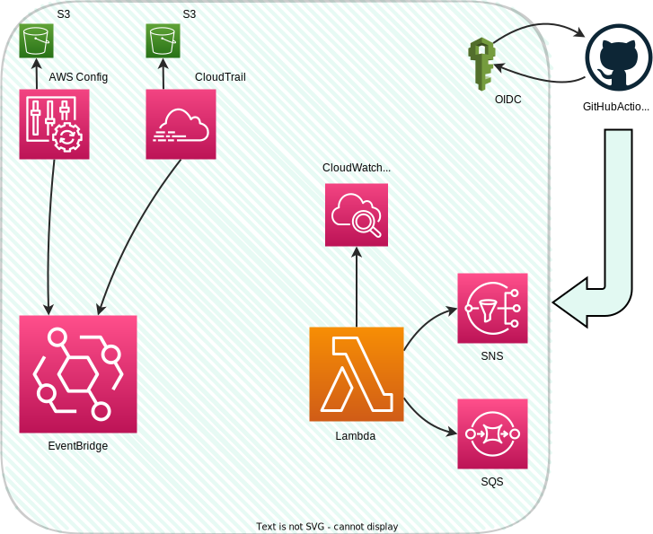

# lambda_alerting
## Project overview
A serverless solution using AWS Lambda to monitor and alert on specific security-related events in an AWS environment. The infrastructure is defined with Terraform and deployed via GitHub Actions.

AWS Services used:
- Lambda - notifies SNS on mutliple security events.
- EventBridge (formerly CloudWatch Events) - EB Rules invoke Lambda function when triggered by Events from CloudTrail and AWS Config.
- AWS Config - monitors Security Groups for non-compliance (any TCP/UDP port open to 0.0.0.0/0).
- CloudTrail - logs Management events, e.g. creation if IAM users.
- SNS - destination for successful Lambda invocations.
- SQS - destination for failed Lambda invocations. Failures could be processed by another AWS service at a later stage.
- S3 - storage for CloudTrail & AWS Config.
- IAM - OIDC for GitHub Actions.

## Architecture diagram


## Prerequisites
Ensure access to the aforementioned AWS services, then:

Create a bucket for Terraform state:
```bash
export PREREQUISITES_BUCKET="prerequisites-lambda-infra" # name has to be gloally unique
aws s3api create-bucket --bucket $PREREQUISITES_BUCKET --region us-east-1
aws s3api put-bucket-versioning --bucket $PREREQUISITES_BUCKET --versioning-configuration Status=Enabled
```
Fork the repository, clone it, change line **29** in `8_oidc.tf` to your GH account and run `terraform apply` locally at least once to set up OIDC for GitHub Actions:
```bash
export AWS_ACCESS_KEY_ID="YOUR_KEY"
export AWS_SECRET_ACCESS_KEY="YOUR_SECRET"
terraform plan && terraform apply --auto-approve
```

In the GitHub repository, define the following Repository Variables:
```bash
AWS_ROLE_TO_ASSUME="arn:aws:iam::YOUR_ACCOUNT_ID:role/github_oidc_role"
AWS_REGION="YOUR_REGION"
```

## Deployment
After addressing the **Prerequisites** section, push to the main branch of your forked repository to trigger static code analys and update the infrastructure via the following jobs (sequantial):
- Static analysis with `pylint`
- Terraform code validation with `terraform validate`
- Terraform plan creation with `terraform plan`
- Terraform infrastructure provisioning with `terraform apply`

The `terraform destroy` job is also available, and can be triggered manually. Pushing to any other branch will only trigger the `pylint`, `terraform validate` and `terraform plan` jobs.

## Testing
Test the notification solution functionality with the following commands:

IAM
- Create a new IAM User:
    ```bash
    aws iam create-user --user-name Timmy --region=us-east-1
    ```
- Create a new Access Key for an IAM User:
    ```bash
    aws iam create-access-key --user-name Timmy --region us-east-1
    ```
---
S3
- Create a Bucket:
    
    ```bash
    export BUCKET="test-lambda-functionality-bucket" # name has to be gloally unique
    aws s3api create-bucket --bucket $BUCKET --region us-east-1
    ```
- Modify Policy (mind the Principal):

    ```bash
    aws s3api put-bucket-policy --bucket $BUCKET --policy file://bucket_policies/policy.json --region us-east-1
    ```
- Modify CORS configuration:

    ```bash
    aws s3api put-bucket-cors --bucket $BUCKET --cors-configuration file://bucket_policies/cors.json --region us-east-1
    ```
- Modify Public access settings:

    ```bash
    aws s3api put-public-access-block --bucket $BUCKET --public-access-block-configuration BlockPublicAcls=false --region us-east-1
    ```
---
Security Groups
- Create a new Security Group in your default VPC:
    ```bash
    export VPC_ID=$(aws ec2 describe-vpcs --filters Name=isDefault,Values=true --query "Vpcs[0].VpcId" --output text --region us-east-1)
    export SG_ID=$(aws ec2 create-security-group --group-name test-sg --description "test SG" --vpc-id $VPC_ID --query "GroupId" --output text --region us-east-1)
    ```
- Open Any TCP/UDP Port to 0.0.0.0/0 on any Security Group:
    ```bash
    aws ec2 authorize-security-group-ingress --group-id $SG_ID --protocol tcp --port 22 --cidr 0.0.0.0/0 --region us-east-1
    ```
---

Confirm Lambda invocations:
```bash
aws cloudwatch get-metric-statistics --namespace AWS/Lambda \
  --metric-name Invocations \
  --dimensions Name=FunctionName,Value=lambda_notify_sns \
  --statistics Sum \
  --start-time $(date -u -d '30 minutes ago' +'%Y-%m-%dT%H:%M:%SZ') \
  --end-time $(date -u +'%Y-%m-%dT%H:%M:%SZ') \
  --period 300 \
  --region us-east-1
```
Confirm message publishing to SNS:
```bash
aws cloudwatch get-metric-statistics --namespace AWS/SNS \
  --metric-name NumberOfMessagesPublished \
  --dimensions Name=TopicName,Value=lambda_success_topic \
  --statistics Sum \
  --start-time $(date -u -d '30 minutes ago' +'%Y-%m-%dT%H:%M:%SZ') \
  --end-time $(date -u +'%Y-%m-%dT%H:%M:%SZ') \
  --period 300 \
  --region us-east-1
```

---
To confirm that each component of the notification system works as expected, one can also use the Console UI:
- CloudTrail:
    - Navigate to Event history and filter by Event name or Resource Type (e.g., Event name: `CreateUser`; Resource Type: `AWS::IAM::User`).
- EventBridge:
    - Go to Rules, select a rule (e.g., `iam-user-or-key-rule`), and check the Monitoring tab for metrics like *Triggered Rules* and *Invocations*.
- AWS Config:
    - Go to Rules, select `vpc-sg-open-only-to-authorized-ports`, and check *Resources in scope* for non-compliant Security Groups.
- Lambda:
    - In the Functions section, select `lambda_notify_sns`, and under Monitor, examine metrics like *Invocations* and *Duration*. Also, review the associated CloudWatch logs.
- CloudWatch Logs:
    - Navigate to Log groups and select `/aws/lambda/lambda_notify_sns` to examine *Log events* generated by each invoked Lambda function.
- CloudWatch Metrics:
    - Use Metrics Explorer to view *All SNS Topic metrics* and see delivered notifications, published messages, etc.

During development, you can manually:

- Test Lambda Function Invocations within the Console UI and inspect the respective CloudWatch logs.
- Test EventBridge Rules by using sample events.
- Test AWS Config Ingress non-compliance by opening any Security Group TCP/UDP port to 0.0.0.0/0.

## A note on using Terraform modules
Modules provide abstraction over complex AWS resources, speeding up infrastructure setup with good defaults. For example, the 'lambda' module includes a boolean parameter `attach_create_log_group_permission` that controls whether to add the *create log group* permission to the CloudWatch logs policy.

Disadvantages include relying on an externally developed module, lack of documentation and inapplicable defaults.

## Assumptions and Limitations
Lambda et al.:
- Lambda function builds are stored locally (as opposed to S3).
- No tests are implemented for the Lambda code.
- SNS subscriptions / Failed SQS queue out of scope.

Terraform:
- Each Terraform file contains only the resources necessary for a single 'component' to function, prioritizing readability over compactness that comes with e.g. computed values, for loops etc.
- State locking is disabled, assuming a single contributor.
- Uploading the Terraform plan as an artifact may pose a security risk if least-privilege principles are not enforced.
- Terraform initialization output is not cached, leading to longer job initialization times in GitHub Actions jobs.

Ingress rules monitoring:
- Non-private IP range: For simplicity sake, Ingress of Security Groups will be monitored for TCP/UDP ports exposed to 0.0.0.0/0 only; this might not equate to a non-private IP range definition of IETF. See [Reserved IP ranges](https://en.wikipedia.org/wiki/Reserved_IP_addresses).
- AWS Config utilizes a managed Rule to check for 0.0.0.0/0 ingress; this rule does not specify who changed the Security Group ingress configuration, only the **account** in which the Security Group became non-compliant. Alternatives:
    - Use CloudTrail instead of AWS Config to alert on any SG Ingress rule change. This event will provide an IAM userName asssociated with the change, but an additional processing step, e.g. a Lambda function, will be needed to filter all Ingress events and then trigger the main Lambda function only when a port was opened to 0.0.0.0/0.
    - Use a custom Rule with AWS Config that can be defined using Guard DSL. This option is enticing but it was dropped due to the additional time overhead for the implementation.  
